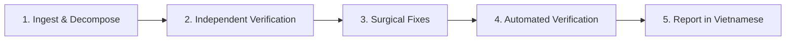

# Code Review Adjudication & Triage (`review-adjudication`)

A specialized agent skill designed to **critically evaluate, independently verify, and selectively act upon** code review feedback (from peers, PR comments, or other AI reviewers).

---

## 🎯 Purpose & Core Value

In real-world software engineering:
1. **Reviewers Are Not Infallible**: AI and human reviewers frequently misjudge database column types (e.g., confusing PostgreSQL `DATE` with `TIMESTAMPTZ`), misunderstand runtime framework behavior, or suggest incorrect timezone offsets.
2. **Prevent Over-Engineering**: Reviewers often propose extracting tiny 3–5 line inline blocks into separate files, introducing unnecessary indirection and violating KISS/YAGNI principles.
3. **Block Scope Creep**: Reviewers often suggest feature enhancements that lie outside the authorized scope of the current pull request or change proposal.

👉 **`review-adjudication` solves these challenges by:**
* **Enforcing Independent Critical Thinking**: Never blindly accept reviewer assertions as truth.
* **Grounding Decisions in Technical Reality**: Cross-examining claims against actual source code, database schemas (`schema.prisma` / SQL migrations), framework runtime semantics, and automated test suites.
* **Implementing Minimal Surgical Fixes**: Only fixing genuine, verified issues (`ACCEPTED_FIX`).
* **Providing Rigorous Technical Proof**: Articulating why invalid suggestions are rejected (`REJECTED_FALSE_POSITIVE`, `REJECTED_OVER_ENGINEERING`).
* **Delivering Structured Reports**: Presenting a clear Markdown adjudication report in **Vietnamese** for the user.

---

## 📂 Directory Structure

```text
.agents/skills/review-adjudication/
├── SKILL.md    # Main skill instructions, workflow & Vietnamese report template (English)
└── README.md   # Skill usage guide, prompt templates & case study (This file)
```

---

## 🧭 5-Tier Decision Matrix

Every finding or recommendation from the review is classified into one of five categories:

| Status | Meaning | Agent Action |
|---|---|---|
| **`ACCEPTED_FIX`** | Genuine bug, security risk, performance degradation, or specification deviation. | **Implement minimal surgical fix + add/update tests.** |
| **`REJECTED_FALSE_POSITIVE`** | Reviewer's claim is technically incorrect, factually wrong, or based on false data type assumptions. | **Do NOT edit code; provide rigorous technical proof citing schemas/code.** |
| **`REJECTED_OVER_ENGINEERING`** | Premature abstraction, redundant wrapper component, or bikeshedding violating KISS/YAGNI. | **Do NOT edit code; justify why the current implementation is cleaner and simpler.** |
| **`DEFERRED_OUT_OF_SCOPE`** | Reasonable suggestion, but falls outside the authorized boundary of the current PR/change. | **Do NOT edit code now; log as backlog recommendation to avoid scope creep.** |
| **`INFORMATIONAL_NOTE`** | Compliments, cosmetic observations, or historical documentation notes. | **Acknowledge only; no code changes.** |

---

## 🚀 How to Use

### 1. Direct Review Evaluation & Selective Fix
Paste the review comments directly into your prompt:
```text
Please use the review-adjudication skill to evaluate the following code review.
Only implement fixes that are valid and reasonable, provide clear technical justifications
for anything that should not be fixed, and report the results in Vietnamese markdown:

[Paste review text here]
```

### 2. Evaluating an Existing Review File
If the review report is saved in a repository file:
```text
Please use the review-adjudication skill to adjudicate the review report in
path/to/review-report.md. Fix only verified valid issues and output the report in Vietnamese.
```

### 3. Dry-Run / Analysis Only (No Code Changes)
If you want to triage and evaluate review findings before making any code modifications:
```text
Apply the review-adjudication skill to analyze the following review comments in dry-run mode.
Do not modify any code yet. Provide a detailed technical breakdown in Vietnamese explaining
which points are valid and which are false positives:

[Paste review text here]
```

---

## 🔄 Agent Execution Protocol

When this skill is invoked, the agent executes the following 5-step pipeline:



1. **Ingest & Decompose**: Extract each finding into an item with ID, file, line, and reviewer claim.
2. **Independent Verification**:
   - Inspect the actual source code and surrounding context.
   - Inspect database schemas (`schema.prisma`), TypeScript interfaces, and framework configurations.
   - Check existing test assertions and runtime behavior.
3. **Surgical Fixes**:
   - Apply edit restrictions per finding rather than per file.
   - Leave code locations associated with `REJECTED_*` and `DEFERRED_*` untouched, while fixing accepted findings within the same file.
4. **Automated Verification**:
   - Run typechecking (`pnpm typecheck`).
   - Run unit & integration tests (`pnpm test`).
   - Run linter (`pnpm lint`).
5. **Output Report in Vietnamese**:
   - Compile and deliver the final report using the structured Vietnamese Markdown template.

---

## 💡 Real-World Case Study (from `feat/dashboard`)

* **Reviewer Claim**:  
  Recommended changing `new Date(\`${today}T00:00:00.000Z\`)` to timezone midnight (17:00 UTC previous day), claiming a 7-hour timezone boundary error.
* **Independent Verification (`REJECTED_FALSE_POSITIVE`)**:  
  - Database schema check: `Reminder.nextTriggerDate` is defined as `@db.Date` in PostgreSQL.
  - PostgreSQL's `DATE` type stores only the calendar date (`YYYY-MM-DD`), with no time or timezone component.
  - `getTodayIso(now, timeZone)` already computes today's date in `Asia/Ho_Chi_Minh`.
  - Prisma Client extracts the UTC date portion for `@db.Date` fields.
  - If shifted to 17:00 UTC previous day, Prisma would query the previous date (`'2026-09-04'::date`), causing a **critical regression by including yesterday's expired reminders**.
  - **Verdict**: Keep original code untouched.
