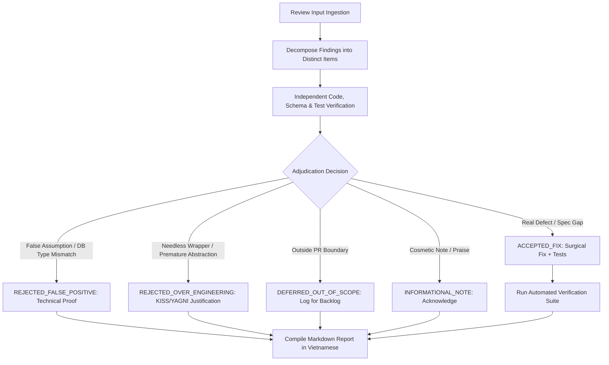

# Code Review Adjudication & Triage

Evaluates third-party code review findings with independent critical thinking, separates genuine defects from false positives or over-engineering, implements only verified valid fixes, and produces a structured Markdown adjudication report in Vietnamese for the user.

> **Prime Directive: Technical Truth Over Reviewer Authority**
> Reviewers can be mistaken, assume incorrect types/database schemas, hallucinate APIs, suggest premature abstractions, or recommend changes that introduce subtle regressions. Never implement a review comment blindly without independent verification against source code, schemas, specifications, and tests.

---

## 1. Core Adjudication Principles

1. **Independent Verification First**:
   Always verify the reviewer's premise against concrete codebase facts:
   - Read the exact referenced source code lines and surrounding context.
   - Inspect underlying database schemas (e.g., PostgreSQL column types: `DATE` vs `TIMESTAMPTZ`, nullability, indexes, constraints).
   - Verify framework/ORM runtime semantics (e.g., Prisma date serialization, Next.js App Router error boundary propagation).
   - Check existing unit, integration, and e2e test coverage and assertions.

2. **Objective 5-Tier Decision Matrix**:
   Classify every review comment into one of five definitive statuses:
   - `ACCEPTED_FIX`: Genuine bug, logic error, security vulnerability, performance degradation, or spec deviation.  
     **Action:** When fix authorization is requested by the user (e.g., "fix nếu hợp lý", "implement fixes"), implement minimal surgical fix and add/update tests. If the user only requested evaluation/review without authorization to edit files, document the accepted finding and proposed diff in the report without modifying source or test files.
   - `REJECTED_FALSE_POSITIVE`: Reviewer's claim is technically incorrect, factually wrong, or based on false assumptions about data types/runtime behavior.  
     **Action:** Do NOT change code; provide clear, factual technical proof explaining why the code is already correct.
   - `REJECTED_OVER_ENGINEERING`: Reviewer suggests unnecessary abstraction (e.g., extracting a 3-line wrapper component for an already clean inline component), speculative architecture, or subjective bikeshedding violating KISS/YAGNI.  
     **Action:** Do NOT change code; explain why the current implementation is cleaner, more readable, and less fragmented.
   - `DEFERRED_OUT_OF_SCOPE`: Suggestion is a reasonable enhancement but falls outside the authorized boundary of the current PR/change.  
     **Action:** Do NOT implement now to prevent scope creep; document it as a recommendation for future iterations.
   - `INFORMATIONAL_NOTE`: Compliments, observations, documentation notes, or praise requiring no code changes.  
     **Action:** Acknowledge only.

3. **Minimal Surgical Fixes**:
   When implementing accepted fixes:
   - Make targeted, minimal edits addressing precisely the defect.
   - Avoid opportunistic refactoring of unrelated code.
   - Always add or update automated tests to guard the fix against future regressions.

4. **Zero-Regression Verification**:
   After applying any fixes:
   - Run typechecking (`pnpm typecheck` or equivalent).
   - Run test suites (`pnpm test` or equivalent).
   - Run linters (`pnpm lint` or equivalent).
   Ensure all checks pass cleanly before concluding.

---

## 2. Step-by-Step Workflow



### Step 1: Ingest & Decompose Review Comments
Extract every individual finding or recommendation from the input review:
- Item ID (e.g., `Rec 2.1`, `Finding 1`)
- Category (Bug, Performance, Architecture, Style, Scope, Documentation)
- Claimed Severity (Must-Fix, Recommendation, Suggestion)
- Target File(s) and Line Number(s)
- Reviewer's core argument and suggested remedy

### Step 2: Independent Technical Verification
For each finding, independently verify:
1. Does the code actually behave the way the reviewer claims?
2. What are the database column types in `schema.prisma` or SQL migrations? (e.g., Does `@db.Date` store time/timezone? No, only `YYYY-MM-DD`!)
3. Would adopting the reviewer's proposal introduce an off-by-one error, timezone regression, or breaking change?
4. Is an abstraction really warranted, or does inline usage reduce complexity?

### Step 3: Surgical Fixes (For `ACCEPTED_FIX` Only)
- Apply edit restrictions per finding rather than per file. Locations associated with `REJECTED_*` or `DEFERRED_*` findings remain unchanged, while accepted findings in the same file may be fixed.
- Make targeted, minimal edits addressing precisely the defect.
- Write or update unit/integration tests to verify the resolution.

### Step 4: Run Automated Verification
Execute:
```bash
pnpm typecheck
pnpm test
pnpm lint
```
Confirm 100% passing tests and zero new type/lint errors.

### Step 5: Generate Report in Vietnamese
Format the final report in Markdown using Vietnamese as specified in Section 3.

---

## 3. Output Report Format (Vietnamese)

> **IMPORTANT**: The final output report MUST be presented to the user in **Vietnamese**, using the following Markdown structure:

```markdown
# Báo cáo Thẩm định Code Review (Review Adjudication Report)

**Mã nguồn / Branch:** `<branch-name>`  
**Bản đối chiếu (Base):** `<base-branch>`  
**Trạng thái thẩm định:** `HOÀN THÀNH` (X/Y đề xuất được chấp thuận và áp dụng)

---

## 1. Bảng tổng hợp thẩm định (Adjudication Summary)

| ID | Vấn đề reviewer nêu | Phân loại | Đánh giá | Quyết định & Hành động |
|---|---|---|---|---|
| 1 | <Mô tả tóm tắt vấn đề> | Bug / Perf / Architecture | Hợp lý / Nhận định sai / Thừa | ACCEPTED_FIX / REJECTED_* / DEFERRED |

### Thống kê nhanh:
- **Tổng số đề xuất thẩm định:** X
- **Chấp thuận & Đã sửa (ACCEPTED_FIX):** A
- **Bác bỏ - Nhận định sai kỹ thuật (REJECTED_FALSE_POSITIVE):** B
- **Bác bỏ - Thừa thãi / Over-engineering (REJECTED_OVER_ENGINEERING):** C
- **Hoãn lại - Ngoài phạm vi (DEFERRED_OUT_OF_SCOPE):** D
- **Ghi nhận thông tin / Không tác động code (INFORMATIONAL_NOTE):** E

---

## 2. Chi tiết thẩm định từng mục (Deep Dive & Technical Justifications)

### [ID] <Tiêu đề đề xuất>
- **Phân loại quyết định:** `ACCEPTED_FIX` | `REJECTED_FALSE_POSITIVE` | `REJECTED_OVER_ENGINEERING` | `DEFERRED_OUT_OF_SCOPE` | `INFORMATIONAL_NOTE`
- **Ý kiến của Reviewer:** <Trích dẫn ngắn gọn lập luận và đề xuất của reviewer>
- **Đối chiếu thực tế mã nguồn & Cơ sở dữ liệu:**
  - File: `path/to/file.ext:line`
  - Kiểu dữ liệu / Database schema / Behavior thực tế: <Dẫn chứng code, schema, types cụ thể>
- **Lý do chấp thuận hoặc bác bỏ:**
  - *Nếu bác bỏ:* Giải thích cặn kẽ vì sao nhận định của reviewer không chính xác, hoặc chứng minh nếu làm theo sẽ gây ra lỗi gì (ví dụ: lệch múi giờ, lấy sai bản ghi, over-engineering).
  - *Nếu chấp thuận:* Nêu rõ lỗi kỹ thuật thực tế và phương án xử lý tối ưu.
- **Hành động đã thực hiện:** <Đã sửa mã nguồn / Giữ nguyên mã nguồn / Ghi nhận backlog>

---

## 3. Các thay đổi mã nguồn đã thực hiện (Applied Fixes)
*(Chỉ hiển thị khi có ít nhất 1 mục ACCEPTED_FIX)*

- **File đã sửa:** `path/to/file.ext`
  - **Tóm tắt giải pháp:** <Mô tả chi tiết cách sửa>
- **Test bổ sung / cập nhật:** `path/to/test.spec.ts`

---

## 4. Kết quả kiểm thử & xác minh (Verification Results)

- **Kiểm tra kiểu dữ liệu (Typecheck):** <✅ Passed (<evidence>) | ❌ Failed (<failure reason>) | ⚠️ Not run>
- **Kiểm thử tự động (Unit & Integration Tests):** <✅ Passed (<evidence>) | ❌ Failed (<failure reason>) | ⚠️ Not run>
- **Kiểm tra chuẩn mã nguồn (Linter):** <✅ Passed (<evidence>) | ❌ Failed (<failure reason>) | ⚠️ Not run>

---

## 5. Kết luận & Khuyến nghị tiếp theo (Final Verdict)

- <Đánh giá tổng thể chất lượng PR/branch, đủ điều kiện merge hay chưa>
- <Các khuyến nghị hoặc lưu ý tiếp theo nếu có>
```

---

## 4. Common Pitfalls to Guard Against

1. **The "Reviewer Hallucination" Trap**:
   Reviewers often assume a column is `TIMESTAMPTZ` with hours/minutes when it is actually a PostgreSQL `DATE` (`@db.Date`), leading to incorrect timezone offset suggestions. Always check `schema.prisma` or migration files!
2. **The "Micro-Component" Trap**:
   Reviewers often suggest extracting tiny 3-line inline blocks into separate files. If a component is specific to one screen, tightly coupled to local state/i18n, and tested, keep it inline (KISS).
3. **The "Breaking Fix" Trap**:
   Never apply a fix that breaks existing unit/integration tests without thoroughly verifying whether the test or the fix is correct.
